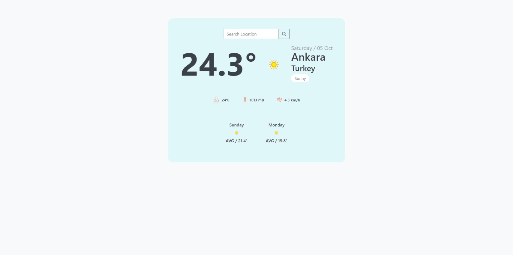

<body style="font-family: Arial, sans-serif; line-height: 1.6; margin: 20px;">

<h1 style="color: #333;">Weather Application</h1>

    This project is a weather application that allows users to view weather data for a specific location.
    Users can enter the desired city to get the current weather, weather conditions, and a 3-day forecast.
    The project uses the <a href="https://www.weatherapi.com/">WeatherAPI</a> service to provide up-to-date weather data.

<h2 style="color: #333;">Features</h2>
<ul>
    <li>Display weather data based on the user's input location.</li>
    <li>Current weather information (temperature, humidity, wind speed, etc.).</li>
    <li>Show a 3-day weather forecast.</li>
    <li>Enhance user experience with weather condition icons.</li>
</ul>

<h2 style="color: #333;">Technologies Used</h2>
<ul>
    <li><strong>Laravel</strong>: Used for the backend infrastructure of the project.</li>
    <li><strong>WeatherAPI</strong>: API used to retrieve weather data.</li>
    <li><strong>Blade Templating Engine</strong>: The template engine that comes with Laravel, enabling dynamic HTML content generation.</li>
</ul>

<h2 style="color: #333;">Project Structure</h2>
<ul>
    <li><strong>Controllers</strong>: Controllers managing the business logic of the application.</li>
    <li><strong>Services</strong>: Services managing interactions with the API.</li>
    <li><strong>Views</strong>: Blade templates that create the user interface.</li>
</ul>

</body>
</html>
